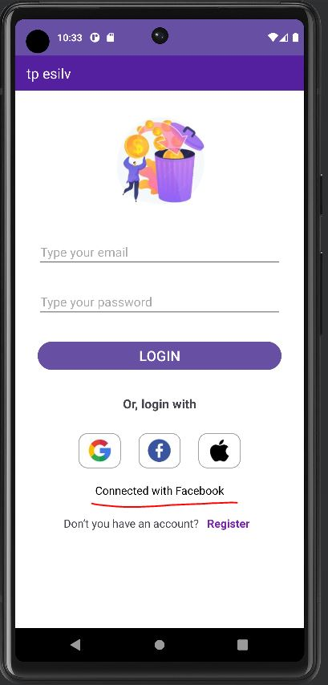

# Mobile Development Project

Ce repo github contient deux sous projets, l'un consistant à reproduire une interface graphique, et l'autre à utiliser une API pour récupérer des données et les affichées.

## Partie 1

Résultat :

Lorsqu'on clique sur un moyen de connexion, un message s'affiche en lien avec l'icone sur lequel on a cliqué

## Partie 2

Pour cette partie 2, j'ai récupéré des données via cette url : https://api.disneyapi.dev/character

J'ai :

- Construit les éléments de la liste avec un MatérialCardview (élément d'interface utilisateur qui implémente le design des cartes de Material Design). Chaque personnage Disney est présenté dans une carte distincte.
- Utilisé un RecyclerView (conteneur pour afficher de grandes ensembles de données qui peuvent être défilées efficacement en recyclant les vues)
- Utilisé la librairie retrofit (permet de faire des requêtes à une API web REST), utilisée pour récupérer les données des personnages Disney depuis l'API Disney. 
- Utilisé la librairie Glide pour le chargement des images, utilisée pour charger les images des personnages depuis les URLs fournies par l'API Disney et pour les afficher dans les ImageViews à l'intérieur de chaque MaterialCardView. 

On peut scroller vers le doigt pour voir tous les personnages qui ont été récupérés :

